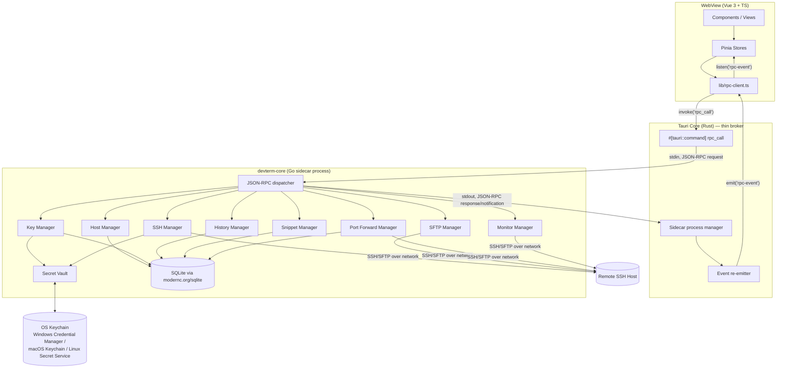
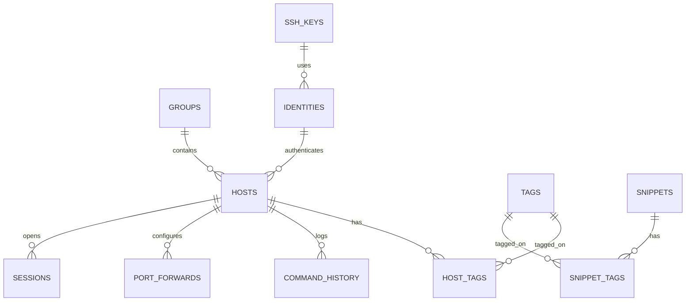
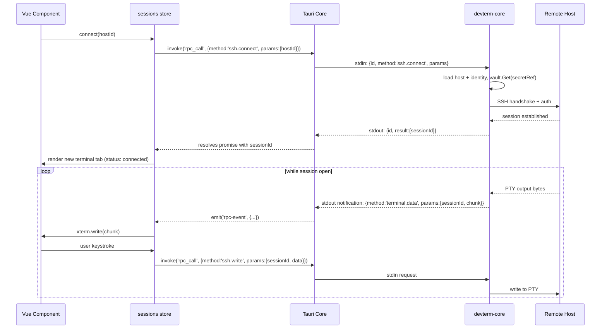

# Design Document

## Overview

DevTerm MVP is a Tauri desktop application with a Vue 3 frontend and a Go backend. The Go backend does not run inside Tauri's Rust core (Tauri core is Rust-only); instead it runs as a **sidecar process** that Tauri spawns, owns, and brokers communication with. All SSH/SFTP/key/host/monitoring logic lives in Go. The Rust core is a thin transport layer. This section documents that decision explicitly because the PRD's architecture diagram (Section 13) draws Go as if it hangs directly off "Tauri IPC," which isn't how Tauri works — clarifying this now avoids a costly redesign mid-implementation.

Two clarifications versus the PRD, both explained in detail below:

1. **Remote monitoring cannot use `gopsutil`.** `gopsutil` reads `/proc`, WMI, and local syscalls — it only ever reports on the machine the Go process itself runs on. Since DevTerm's dashboard shows stats for a *remote* SSH host, metrics must come from commands executed over the SSH session (agentless), not from a local-machine library. `gopsutil` is not used in this spec.
2. **SQLite driver**: use `modernc.org/sqlite` (pure Go, CGo-free) instead of `mattn/go-sqlite3`. The Go binary must cross-compile for 6 OS/arch targets as a sidecar; CGo cross-compilation requires per-target C toolchains and materially complicates CI. The performance difference is negligible at desktop-app data scale.

## Architecture

### High-level structure



### Process & IPC model

**Decision: stdio-framed JSON-RPC 2.0, not a loopback socket.**

Alternatives considered:
- *Loopback TCP with a random port + token*: cross-platform-simple, but opens a local network port that any other local process could probe (mitigated but not eliminated by a handshake token). Unnecessary surface area for an app whose stated value includes "secure by default."
- *Unix domain socket / Windows named pipe*: no network exposure, but requires platform-specific code (Windows has no named-pipe support in Go's stdlib; needs `Microsoft/go-winio`), adding complexity for no real benefit over stdio.
- **stdio (chosen)**: Tauri spawns the sidecar as a child process already connected to it via OS pipes. No port, no socket file, no discoverability by other processes. This is the same approach used by the Language Server Protocol and is explicitly suggested by [Tauri's sidecar docs](https://v2.tauri.app/develop/sidecar/).

Framing: `Content-Length: <n>\r\n\r\n<json>` (identical to LSP), each message a JSON-RPC 2.0 object.

- **Requests** (frontend → Go): `{"id": "...", "method": "hosts.list", "params": {...}}`. Rust core generates/tracks the `id`, forwards over stdin, and resolves the pending Tauri command promise when a response with matching `id` arrives on stdout.
- **Responses**: `{"id": "...", "result": {...}}` or `{"id": "...", "error": {"code": ..., "message": ..., "data": {...}}}`.
- **Notifications** (Go → frontend, no `id`, unsolicited): `{"method": "terminal.data", "params": {"sessionId": "...", "chunk": "base64..."}}`. Rust re-emits these as Tauri events on channel `rpc-event`; the frontend's single `listen('rpc-event', ...)` dispatches by `method` + an embedded session/job id to the right store/component.

This gives Vue components a single call shape (`rpcClient.call(method, params)`) and a single subscription point for all streaming data (terminal output, transfer progress, live metrics, connection state changes), instead of one bespoke Tauri command per operation.

**Rust core responsibilities (intentionally minimal):**
- Spawn/supervise the `devterm-core` sidecar; restart it if it crashes and surface a "backend unavailable" state to the UI rather than silently hanging.
- Own the stdin writer and stdout reader loops; correlate request/response by `id`.
- Expose exactly two Tauri commands: `rpc_call(method, params) -> result` and `rpc_cancel(id)` (best-effort cancellation, e.g. aborting a running SFTP transfer).
- Re-emit notifications as Tauri events.
- Hold no business logic, no SQLite access, no SSH code.

### Project structure

```
DevTerm/
├── src/                          # Vue 3 frontend
│   ├── components/
│   ├── views/
│   ├── stores/                   # Pinia
│   ├── composables/
│   └── lib/rpc-client.ts
├── src-tauri/                    # Rust shell
│   ├── src/main.rs, sidecar.rs
│   ├── binaries/                 # built devterm-core-<target-triple> placed here for bundling
│   └── tauri.conf.json
├── core/                         # Go module — the sidecar
│   ├── cmd/devterm-core/main.go
│   └── internal/
│       ├── rpc/                  # dispatcher, framing, method registry
│       ├── sshmgr/
│       ├── hostmgr/
│       ├── keymgr/
│       ├── sftpmgr/
│       ├── forwardmgr/
│       ├── historymgr/
│       ├── snippetmgr/
│       ├── monitor/
│       ├── vault/                # keychain + AES-256 fallback
│       ├── db/                   # sqlite access + migrations
│       └── models/
└── .kiro/specs/devterm-mvp/
```

## Components and Interfaces

### Frontend

| Area | Pieces |
|---|---|
| State | Pinia stores: `hosts`, `sessions` (open tabs/panes + connection status), `keys`, `snippets`, `history`, `settings`, `forwards` |
| Terminal | `composables/useTerminal.ts` wraps `@xterm/xterm` + `@xterm/addon-fit` + `@xterm/addon-search`; feeds/reads bytes via the `sessions` store, which is fed by `terminal.data` notifications |
| Host management | `HostList`, `HostForm`, `HostGroupTree`, `HostSearchBar` (shadcn-vue `Command` component for fuzzy search) |
| Terminal UI | `TerminalTabs`, `SplitPane` (resizable panes), `TerminalSearchBar` |
| Files | `FileBrowser` — dual-pane (local/remote) SFTP view, drag & drop, progress bars |
| Snippets/History | `SnippetPanel`, `HistoryPanel`, both with live filter input |
| Keys | `KeyManagerPanel`, `KeyGenerateDialog`, `KeyImportDialog` |
| Port forwarding | `ForwardRuleList`, `ForwardRuleForm` |
| Dashboard | `MetricsPanel` (CPU/mem/disk/net/uptime cards + sparkline/line charts) |
| IPC | `lib/rpc-client.ts` — typed `call<TParams, TResult>(method, params)`, `subscribe(method, handler)` |

Vue-router is used only for top-level sections (Connections / Keys / Snippets / Settings); open terminal sessions and split panes are in-memory UI state in the `sessions` store, not routes — they aren't meaningfully linkable and shouldn't reset on navigation.

### Go backend (`core/internal/...`)

Each manager registers its RPC methods with the dispatcher at startup. Method names are namespaced by manager.

| Manager | Sample RPC methods | Responsibility |
|---|---|---|
| `hostmgr` | `hosts.list`, `hosts.create`, `hosts.update`, `hosts.delete`, `hosts.search` | CRUD + search over hosts/groups/tags (Req 2) |
| `sshmgr` | `ssh.connect`, `ssh.disconnect`, `ssh.write`, `ssh.resize` | Session lifecycle, PTY I/O, auth method dispatch (Req 1, 3) |
| `keymgr` | `keys.generate`, `keys.import`, `keys.list`, `keys.delete` | RSA/ED25519 generation, import validation, fingerprinting (Req 8) |
| `sftpmgr` | `sftp.list`, `sftp.upload`, `sftp.download`, `sftp.rename`, `sftp.delete` | Remote FS browsing + transfers with progress notifications (Req 6) |
| `forwardmgr` | `forward.start`, `forward.stop`, `forward.list` | Local/remote/dynamic tunnels bound to a live SSH connection (Req 7) |
| `historymgr` | `history.record`, `history.search` | Per-host command history (Req 4) |
| `snippetmgr` | `snippets.list`, `snippets.create`, `snippets.update`, `snippets.delete` | Snippet CRUD/search (Req 5) |
| `monitor` | `monitor.start`, `monitor.stop` (pushes `monitor.tick` notifications) | Polls remote host via SSH-executed commands, parses output (Req 9) |
| `vault` | (internal only, not exposed as RPC) | Secret storage abstraction used by `hostmgr`/`keymgr`/`sshmgr` |
| `db` | (internal only) | SQLite connection, migrations, query helpers |

**Monitor manager detail** (clarification vs. PRD's `gopsutil` reference): on connect, `monitor` detects remote OS family (`uname -s` vs `ver`) and runs a small set of portable commands over the existing SSH session — e.g. Linux: read `/proc/stat`, `/proc/meminfo`, `df -P`, `/proc/net/dev`, `/proc/uptime`; macOS: `top -l 1`, `vm_stat`, `df -P`, `uptime`. Output is parsed into a common `Metrics` struct and pushed as a `monitor.tick` notification every poll interval (default 3s, configurable). No agent install on the remote host is required, consistent with DevTerm being a zero-footprint SSH client. If required commands are missing/blocked (Req 9.3), the manager reports a partial `Metrics` struct with per-field `unavailable: true` flags rather than failing the whole tick.

## Data Models

Expands the PRD's 3-table sketch (Section 14) into a normalized schema. All tables live in one local SQLite file (`devterm.db`), managed via versioned migrations in `core/internal/db/migrations`.



```sql
-- Organization
CREATE TABLE groups (
  id INTEGER PRIMARY KEY,
  name TEXT NOT NULL UNIQUE,
  created_at TEXT NOT NULL DEFAULT (datetime('now'))
);

CREATE TABLE tags (
  id INTEGER PRIMARY KEY,
  name TEXT NOT NULL UNIQUE
);

-- Auth material (no plaintext secrets here — see Secret Vault below)
CREATE TABLE ssh_keys (
  id TEXT PRIMARY KEY,             -- uuid
  name TEXT NOT NULL,
  key_type TEXT NOT NULL CHECK (key_type IN ('rsa','ed25519')),
  public_key TEXT NOT NULL,
  fingerprint TEXT NOT NULL,
  passphrase_protected INTEGER NOT NULL DEFAULT 0,
  vault_ref TEXT NOT NULL,         -- opaque key into the Secret Vault for the private key (+ passphrase)
  created_at TEXT NOT NULL DEFAULT (datetime('now'))
);

CREATE TABLE identities (
  id TEXT PRIMARY KEY,             -- uuid
  name TEXT NOT NULL,
  auth_type TEXT NOT NULL CHECK (auth_type IN ('password','key','agent')),
  ssh_key_id TEXT REFERENCES ssh_keys(id) ON DELETE SET NULL,
  vault_ref TEXT,                  -- opaque key into the Secret Vault for password (auth_type='password' only)
  created_at TEXT NOT NULL DEFAULT (datetime('now'))
);

-- Hosts
CREATE TABLE hosts (
  id TEXT PRIMARY KEY,             -- uuid
  name TEXT NOT NULL,
  hostname TEXT NOT NULL,
  port INTEGER NOT NULL DEFAULT 22,
  username TEXT NOT NULL,
  identity_id TEXT REFERENCES identities(id) ON DELETE SET NULL,
  group_id INTEGER REFERENCES groups(id) ON DELETE SET NULL,
  favorite INTEGER NOT NULL DEFAULT 0,
  created_at TEXT NOT NULL DEFAULT (datetime('now')),
  updated_at TEXT NOT NULL DEFAULT (datetime('now'))
);
CREATE INDEX idx_hosts_group ON hosts(group_id);
CREATE INDEX idx_hosts_favorite ON hosts(favorite);

CREATE TABLE host_tags (
  host_id TEXT NOT NULL REFERENCES hosts(id) ON DELETE CASCADE,
  tag_id INTEGER NOT NULL REFERENCES tags(id) ON DELETE CASCADE,
  PRIMARY KEY (host_id, tag_id)
);

-- Connection tracking (lightweight — full session recording is a later spec)
CREATE TABLE sessions (
  id TEXT PRIMARY KEY,             -- uuid
  host_id TEXT NOT NULL REFERENCES hosts(id) ON DELETE CASCADE,
  started_at TEXT NOT NULL DEFAULT (datetime('now')),
  ended_at TEXT
);
CREATE INDEX idx_sessions_host ON sessions(host_id);

CREATE TABLE command_history (
  id INTEGER PRIMARY KEY AUTOINCREMENT,
  host_id TEXT NOT NULL REFERENCES hosts(id) ON DELETE CASCADE,
  command TEXT NOT NULL,
  executed_at TEXT NOT NULL DEFAULT (datetime('now'))
);
CREATE INDEX idx_history_host ON command_history(host_id, executed_at DESC);

CREATE TABLE snippets (
  id TEXT PRIMARY KEY,             -- uuid
  title TEXT NOT NULL,
  command TEXT NOT NULL,
  created_at TEXT NOT NULL DEFAULT (datetime('now')),
  updated_at TEXT NOT NULL DEFAULT (datetime('now'))
);

CREATE TABLE snippet_tags (
  snippet_id TEXT NOT NULL REFERENCES snippets(id) ON DELETE CASCADE,
  tag_id INTEGER NOT NULL REFERENCES tags(id) ON DELETE CASCADE,
  PRIMARY KEY (snippet_id, tag_id)
);

CREATE TABLE port_forwards (
  id TEXT PRIMARY KEY,             -- uuid
  host_id TEXT NOT NULL REFERENCES hosts(id) ON DELETE CASCADE,
  type TEXT NOT NULL CHECK (type IN ('local','remote','dynamic')),
  local_host TEXT NOT NULL DEFAULT '127.0.0.1',
  local_port INTEGER NOT NULL,
  remote_host TEXT,                -- null for dynamic (SOCKS)
  remote_port INTEGER,             -- null for dynamic (SOCKS)
  created_at TEXT NOT NULL DEFAULT (datetime('now'))
);

CREATE TABLE settings (
  key TEXT PRIMARY KEY,
  value TEXT NOT NULL              -- JSON-encoded
);

CREATE TABLE schema_migrations (
  version INTEGER PRIMARY KEY,
  applied_at TEXT NOT NULL DEFAULT (datetime('now'))
);
```

### Secret Vault (`internal/vault`)

Satisfies Req 8.4 and Req 10.1/10.2. A single interface, two implementations, chosen at startup based on OS keychain availability:

```go
type Vault interface {
    Put(ref string, secret []byte) error
    Get(ref string) ([]byte, error)
    Delete(ref string) error
}
```

1. **`KeychainVault`** (default): backed by `zalando/go-keyring`, which maps to Windows Credential Manager, macOS Keychain, and Linux Secret Service (D-Bus) — one secret per `vault_ref` (a random UUID stored in SQLite, never the secret itself).
2. **`EncryptedFileVault`** (fallback, e.g. headless Linux with no Secret Service running): a single file (`vault.dat`) containing AES-256-GCM encrypted entries keyed by `vault_ref`. The file-encryption key is itself stored via OS-specific minimal primitives where possible (DPAPI-protected blob on Windows), or derived via Argon2id from a user-set master passphrase on first run if no OS primitive is available, prompting the user once per app session. This directly satisfies the PRD's explicit "AES-256 encryption" requirement (Section 11) as a defense-in-depth layer even when the keychain path is used for the primary secret, and as the sole protection when it isn't.

Private key files imported by the user are read once, parsed/validated, and their key material is moved into the vault — the original file on disk is never referenced again by DevTerm.

## Key Flows

### Connect + interactive terminal



### SFTP upload with progress

`sftp.upload` returns immediately with a `transferId`; progress and completion arrive as `sftp.progress` / `sftp.complete` notifications (percent, bytes/sec, ETA), matching the pattern used for terminal streaming so the frontend has one consistent subscription model. `rpc_cancel(transferId)` aborts an in-flight transfer (Req 6.6 — partial file is left in place, flagged in the UI as incomplete, safe for the user to delete or resume-by-retry).

### Dashboard metrics

`monitor.start` begins a polling loop scoped to a `sessionId`; each tick is a `monitor.tick` notification. Polling stops automatically on `ssh.disconnect` (Req 7.5's "stop associated resources on disconnect" principle applies here too) or explicit `monitor.stop`.

## Error Handling

All RPC errors use a consistent shape: `{code, message, data?}`. Codes are coarse-grained categories the frontend can branch on without parsing message strings:

| Code | Meaning | Typical UI response |
|---|---|---|
| `AUTH_FAILED` | Bad password/passphrase/key rejected by host | Inline error on connect dialog, keep dialog open for retry (Req 1.7) |
| `CONN_UNREACHABLE` | TCP/DNS failure, timeout | Toast + status badge "unreachable"; offer retry |
| `CONN_LOST` | Established session dropped | Status badge "disconnected"; stop dependent forwards/monitors (Req 7.5) |
| `VAULT_UNAVAILABLE` | Keychain and fallback both failed | Blocking dialog — cannot proceed with secret-dependent action |
| `SFTP_ERROR` | Remote FS operation failed (permissions, not found, disk full) | Inline error in file browser row, transfer marked failed not silently dropped |
| `VALIDATION` | Bad input (malformed key, invalid port range) | Inline form field error |
| `INTERNAL` | Unexpected backend error | Toast with generic message; full detail logged locally for diagnostics |

The Rust broker treats a sidecar crash/exit as `INTERNAL` for all in-flight requests, then attempts one automatic sidecar restart; a second crash within a short window surfaces a persistent "backend unavailable, restart app" banner rather than looping silently.

## Security Considerations

- **No plaintext secrets at rest**: passwords, passphrases, and private keys never touch SQLite; only opaque `vault_ref` UUIDs are stored there (Req 8.4, 10.1, 10.2).
- **IPC attack surface**: stdio-only transport between Rust and Go means no local port is ever opened for this communication — nothing on the machine other than the Tauri-spawned child process can reach the backend.
- **No default telemetry** (Req 10.3): no network calls are made by DevTerm other than to hosts the user explicitly configures. This should be enforced by not linking any analytics SDK into either the Rust or Go binary for this MVP scope.
- **Offline-first** (Req 10.4): all CRUD for hosts/keys/snippets/history/settings works with zero network access; only `ssh.*`, `sftp.*`, `forward.*`, `monitor.*` require connectivity to the target host.
- **Key generation**: RSA (2048-bit minimum, default 4096) and ED25519 via `golang.org/x/crypto/ssh` + Go's `crypto/rsa`/`crypto/ed25519`, generated entirely locally — never sent anywhere.
- **Host key verification**: not called out explicitly in the PRD, but required for a secure SSH client — DevTerm maintains a local known-hosts store and prompts the user on first-connect / on host key change (classic TOFU model), rather than silently accepting any host key. Flagging this now since silently skipping host key checks would be a real security regression versus tools like OpenSSH/PuTTY.

## Performance Considerations

- Terminal output is base64-framed JSON per chunk; for very high-throughput output (e.g. `cat` of a large file) the Go side coalesces buffered PTY output on a short timer (~8ms) before emitting, capping notification rate rather than emitting per-byte.
- SFTP transfers stream in fixed-size chunks (e.g. 32KB) directly through `pkg/sftp`, independent of the RPC layer's framing, to keep memory bounded for large files.
- SQLite: WAL mode enabled; indices added on all foreign keys and search-relevant columns (see schema above) to keep host/snippet/history search responsive as data grows (Req 2.5, 4.2, 5.2).
- Monitor polling defaults to 3s; the UI should allow slowing this down per-host to reduce load on constrained remote hosts.

## Testing Strategy

- **Go backend**: table-driven unit tests per manager; `sshmgr`/`sftpmgr`/`monitor` tested against an in-process test SSH server (`gliderlabs/ssh` or an equivalent local server built on `golang.org/x/crypto/ssh`) rather than real remote hosts. `db` layer tested against a temp-file SQLite DB with migrations applied.
- **Frontend**: Vitest + Vue Test Utils for composables/components, with `rpc-client` mocked at the `invoke`/`listen` boundary so component tests don't depend on a running sidecar.
- **Cross-platform build verification**: CI builds the Go sidecar for all 6 target triples (win/mac/linux × x64/arm64) and confirms the Tauri bundle step picks up the correctly named binary in `src-tauri/binaries/`.

(Per project convention, actual test suites are written when requirements are implemented, not scaffolded speculatively in this design phase.)

## Assumptions & Decisions Log

Minor choices made without needing a decision from you, noted here for visibility:

- **Pinia** for frontend state management — the standard choice for Vue 3, not named in the PRD but implied by "Vue 3."
- **vue-router** scoped to top-level sections only; terminal tabs/panes are store-managed UI state, not routes.
- **`modernc.org/sqlite`** over `mattn/go-sqlite3` — see Overview.
- **`zalando/go-keyring`** for OS keychain integration, with a custom AES-256-GCM file vault as fallback.
- **stdio JSON-RPC (LSP-style framing)** for Rust↔Go IPC instead of a loopback socket — see Architecture.
- **Remote monitoring via SSH-executed commands**, not `gopsutil` — see Overview.
- **Host key verification (TOFU)** added even though not explicit in the PRD — treated as a baseline security requirement for any SSH client rather than an optional extra.
